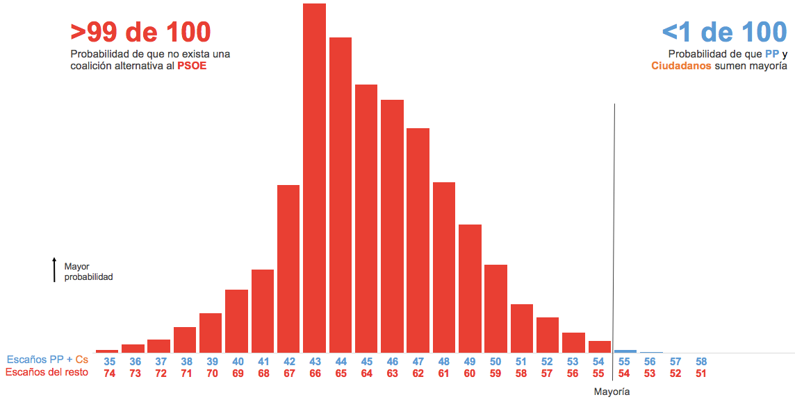
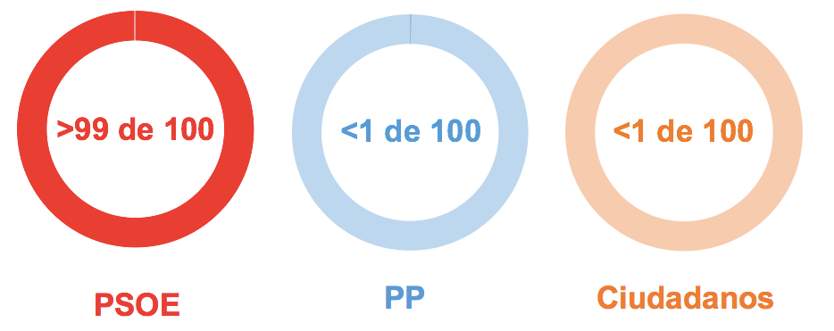
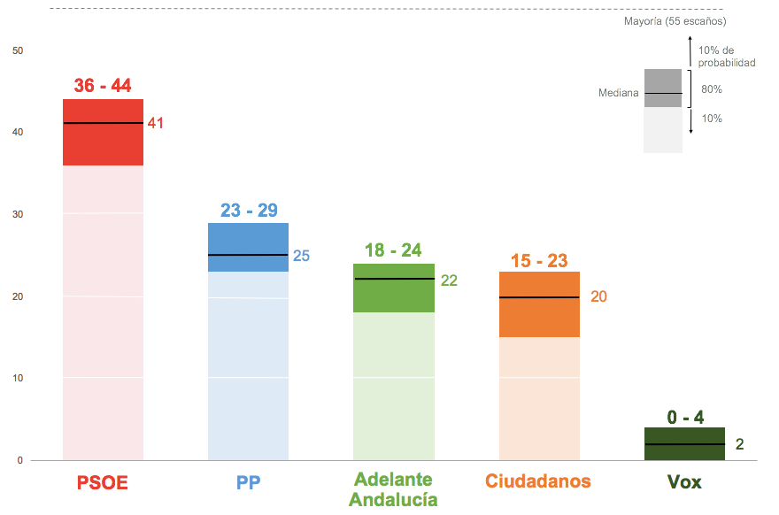
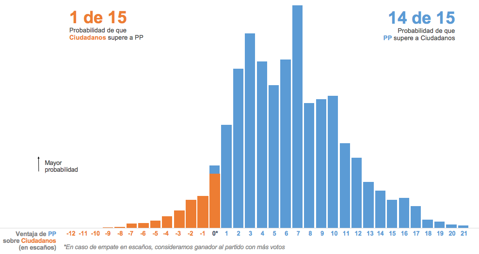

# Pronóstico: Elecciones Andaluzas 2018

*Última actualización: 26 de noviembre de 2018*

## ¿Quién tendrá la mayoría?

## ¿Quién gobernará?

## ¿Cómo quedará el parlamento?

### ¿Quién liderará el centro derecha?

## Más información
[Este artículo](https://www.inakiarbeloa.com/modelo-prediccion-elecciones-andaluzas-2018) explica el modelo de predicción y los gráficos.

## Referencias
Este ejercicio esta inspirado principalmente por el trabajo de Nate Silver y su equipo en [FiveThirthyEight](https://projects.fivethirtyeight.com/2018-midterm-election-forecast/house/). También he seguido con interés a Nate Cohn en [The Upshot](https://www.nytimes.com/interactive/2018/11/06/us/elections/results-house-forecast.html), a G. Elliott Morris y su blog [The Crosstab](https://www.thecrosstab.com/project/2018-midterms-forecast/), el modelo de predicción de [The Economist](https://www.economist.com/graphic-detail/2018/05/24/whos-ahead-in-the-mid-term-race) y el trabajo de Kiko Llaneras en [El País](https://elpais.com/politica/2017/12/18/ratio/1513610647_109254.html).