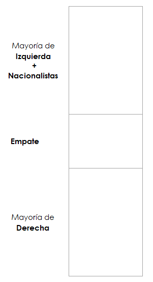
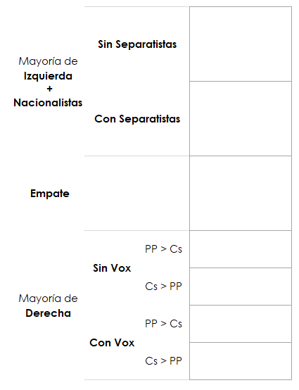
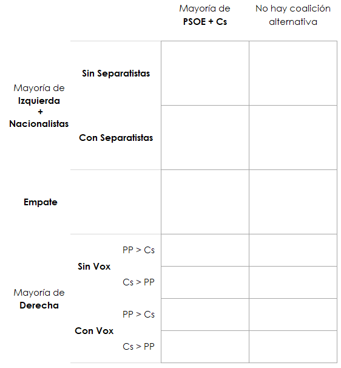
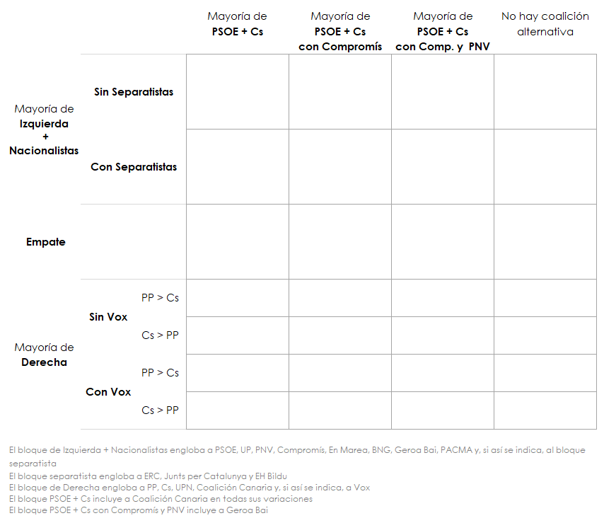
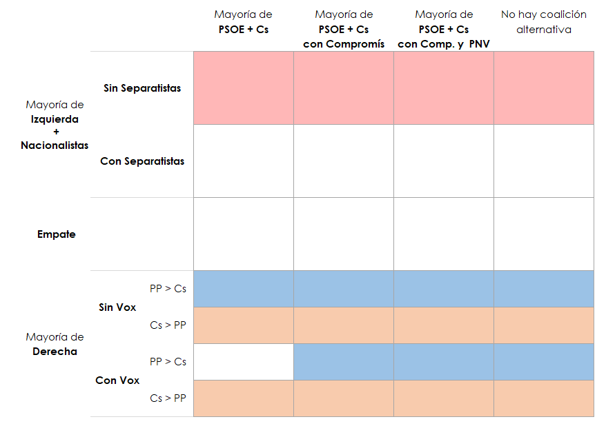
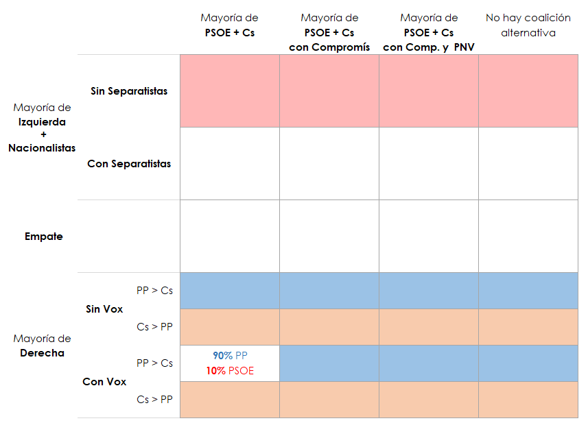
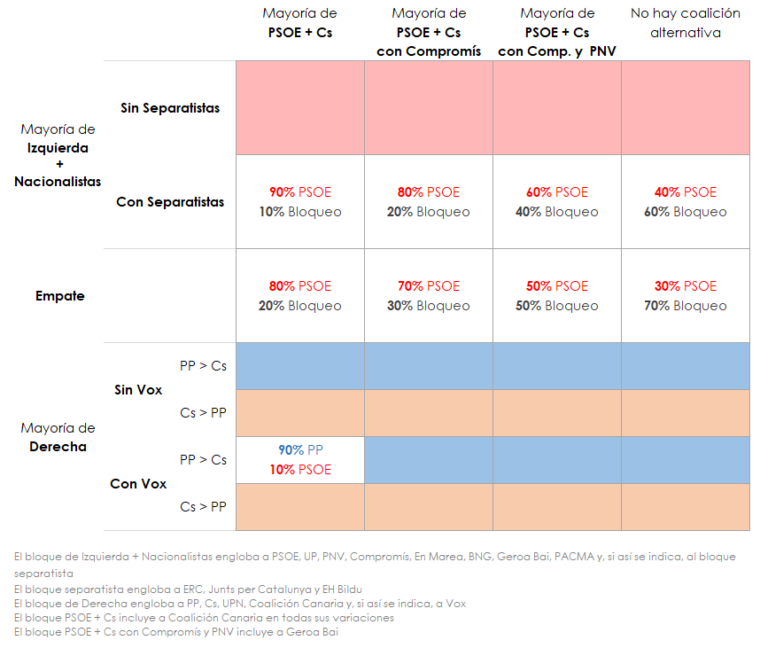

# Metodología del segundo modelo: La elección del presidente

## Paso 1: Dibujar los escenarios posibles

El objetivo es crear una clasificación de todos los escenarios post-electorales. Esa clasificación debe ser lo más relevante posible de cara a predecir una futura investidura.

### El eje izquierda - derecha
La clasificación más obvia sería entre la mayoría que invistió al gobierno actual y los partidos que se opusieron. Esto nos da tres escenarios posibles. Una de tres: o el grupo de la moción de censura mantiene la mayoría, o la oposición la alcanza, o se produce un empate.

Es decir, que el día 29 estaremos en uno (y solo uno) de estos tres cuadrados:

Ojo, esto no quiere decir que la investidura se vaya a decidir necesariamente en estos bloques.

Podemos dividir los dos bloque principales en varios escenarios distintos:
* En el caso de que la izquierda tenga mayoría, la clave será si necesita o no a los partidos independentistas catalanes y/o a Bildu para formar esa mayoría.
* En el caso de que la derecha tenga mayoría, tenemos dos claves: si necesita a Vox  y quién lidera esa mayoría.

### Coaliciones alternativas
Más allá de los dos bloques actuales, la otra coalición con la que se especula es la del PSOE con Ciudadanos. Esta opción multiplica por dos el número de escenarios:

Si esta coalición llegase a un acuerdo, es probable que contase con el apoyo de Coalición Canaria, que ya apoyó el "pacto del abrazo" en 2016.

En algunos escenarios cercanos al bloqueo, a este pacto quizá podría sumarse Compromís, que ya se mostró favorable a apoyar la primera investidura de Sánchez, o incluso el PNV:

Este mapa indica 28 escenarios posibles. El día después de las elecciones estaremos en uno de esos 28 cuadrados.

## Paso 2: Interpretar quién gobernaría en cada escenario

Para estimar quién gobernaría en cada escenario, empezamos con un axioma que asumimos como cierto para simplificar el proceso: El PSOE tendrá más escaños que UP y que Ciudadanos, y por lo tanto lideraría cualquier acuerdo con cualquiera de los dos.

En primer lugar, completamos los escenarios más claros. Si el bloque de derecha alcanza la mayoría, parece claro que formará gobierno. Si el PSOE alcanza la mayoría sin los independentistas y sin Bildu, también está bastante claro que formará gobierno:

La excepción más plausible es que Ciudadanos tenga que elegir entre dar el gobierno al PP con Vox o dárselo al PSOE. Las declaraciones de Ciudadanos indican que pactarían con el PP, pero asignamos un 10% de posibilidad a que acabarían pactando con el PSOE:

En los 8 escenarios restantes, existe un riesgo de bloqueo considerable: 4 escenarios incluyen un empate y los otros 4 repiten la aritmética que ha llevado a este adelanto electoral. Los porcentajes asignados en estos casos son muy subjetivos e incluso especulativos, pero la comparativa entre escenarios se basa en criterios objetivos: El riesgo de bloqueo aumenta conforme disminuye la disponibilidad y viabilidad de coaliciones alternativas.

## Paso 3: Estimar la probabilidad de cada escenario

La tabla del Paso 2 nos indica la probabilidad de cada candidato de alcanzar la presidencia del gobierno en los distintos escenarios. La predicción de la composición del Congreso del primer modelo nos indica la probabilidad de cada escenario. La combinación de esos dos elementos resulta en la probabilidad de cada candidato de alcanzar la presidencia.

*Para consultar la metodología del primero modelo, haz click [aquí](https://www.inakiarbeloa.com/metodologia-del-primer-modelo-la-composicion-del-congreso).*